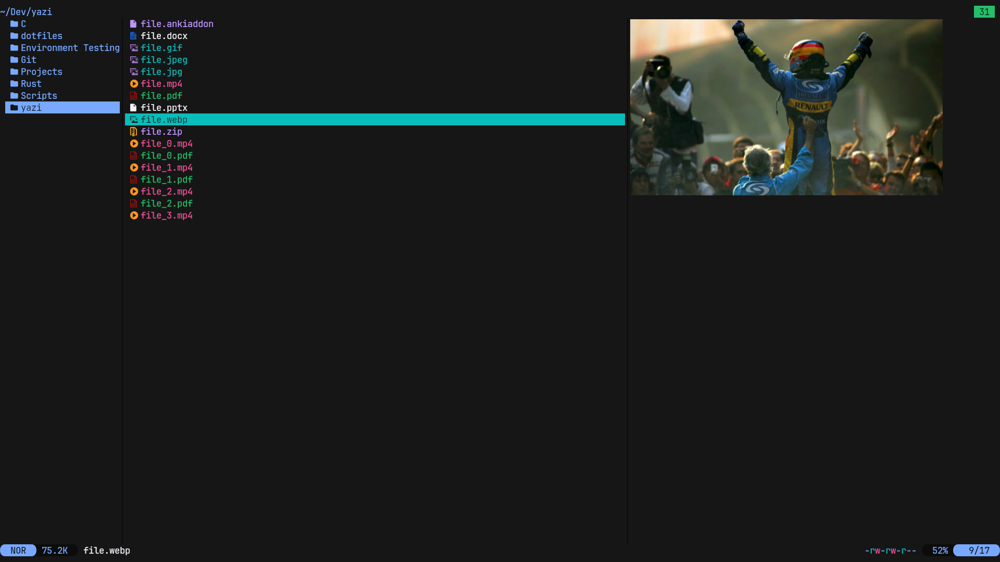

<div align="center">
  
</div>

## Preview



## Usage

Add these lines to your `theme.toml` configuration file to use it:

```toml
[flavor]
use = "carbonfox"
# For Yazi 0.4 and above
dark = "carbonfox"
```

## License

The flavor is MIT-licensed.

Check the [LICENSE](LICENSE).

This flavor is based on [BennyOe tokyo-night.yazi](https://github.com/BennyOe/tokyo-night.yazi)
